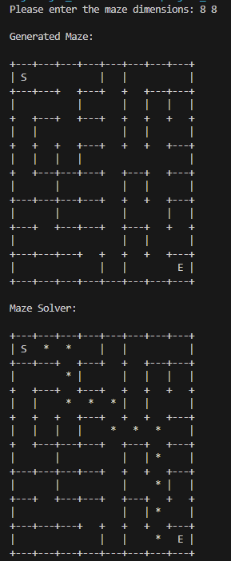
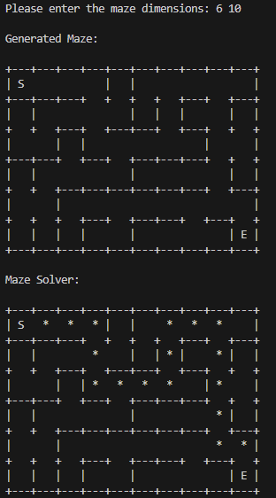

# CS-2336-Term-project
Maze generator and solver for the course CS 2336


## About this project: 

This project implements a complete maze generator and solver using Java. The maze is represented as a graph using an adjacency list, generated with Prim's algorithm, and solved using Depth First Search. The project includes four main classes:
- Cell
- Maze
- MazeSolver
- Main
The output is displayed as ASCII sysmbols to represent the walls/spaces.

## Design Choices
### Maze generation

Maze is represented as adjacency list of ```Map<Cell, List<Cell>>``` . A 2D ```Cell[][]``` grid for maze to help with printing or graph processing.

#### Prim's algorithm: Every cell begins with no connections. During Prim's algorithm, connections(edges) are created by adding neighbors to each other's adjacency list.
1. Pick a random cell inside the maze.
2. Mark this cell as being in the maze.
3. Add all of its neighbors to the frontier set.

4. Repeatedly:
    - Select a random frontier cell
    - Choose one of its neighbors that is already in the maze
    - Add an edge between the two cells
    - Mark the frontier cell as part of the maze
    - Add its neighbors to the frontier
    - This continues until there are no frontier cells left.

### Maze Solver

Maze is solved using DFS where start S is set to be (0,0) and end goal cell E is (rows-1, cols-1)

#### DFS: It is implemented using ```Stack<Cell>, Set<Cell> visited, Map<Cell, Cell> parent```
1. Push the start cell onto the stack
2. While the stack is not empty:
    - pop a cell
    - If it reaches the end, stop
    - Otherwise push all unvisited adjacent cells
    - Record each cell's parent
3. Backtrack from the end to the start using the parent map to reconstruct the path.
The path is then printed using ```printSolvedMaze()``` in ```Maze.java``` file.

### Cell class
Stores the row and column of a cell. It implements ```equals()``` and ```hashCode()``` (31 is is used in the key because it is a prime number and helps reduce collisions)

## Output
The maze takes an input of ```rows cols```.
For example, the sample input of 8 8, results in:





